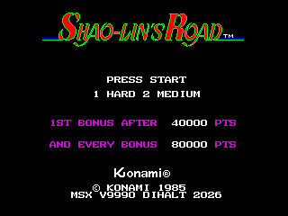
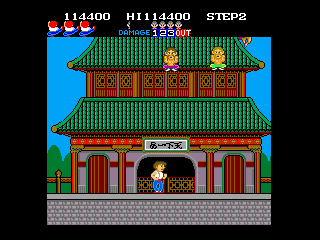

# Shao-lin's Road for MSX + V9990

**Konami's 1985 arcade game *Shao-lin's Road*, running on an MSX1 with a Yamaha V9990 (GFX9000) graphics card:
two tile planes, hardware sprites, the arcade music and effects on SCC + PSG, 60 frames per second.**

An unofficial homage port by **DiHalt Studio**, 2026.

 

## Play it

Download `shaolins_v9990.rom` from the [Releases](../../releases) page. It is a 1 MiB ROM for the Konami SCC mapper and
needs a GFX9000 (V9990) cartridge next to it.

* **Real MSX:** MSX1 or better with 64 KB of RAM, two cartridge slots (game and V9990), a monitor on the V9990's
  video output. An SCC is optional (music on the PSG without it).
* **openMSX:** with the GFX9000 extension:

```sh
make run          # Sony HB-10P + GFX9000 (looks for release/shaolins_v9990.rom)
make run-turbor   # Panasonic FS-A1GT (turbo R) + GFX9000
```

The game is the arcade program translated to Z80, so it plays as the arcade does. The manual explains
everything for a player: **[English](docs/manual/manual-en.pdf)** · **[Español](docs/manual/manual-es.pdf)**.

| Key / joystick 1 | Action |
|---|---|
| Cursor keys, stick | move; up jumps to the floor above, down drops to the floor below |
| `SPACE` / `Z` / button A | kick |
| `M` / `X` / button B | jump |
| `1`, `SPACE` or button A at the title | start in **hard** mode |
| `2` or button B at the title | start in **medium** mode |

No coins, no credits, one player, 3 lives, extra life at 40,000 and every 80,000.

## Building from source

The port is made by translating the arcade program, so building needs data derived from the arcade ROM set that is
**not distributed here** (the ROMs belong to their rights holders): put it in `arcade/` (or `make ARCADE=path`):

| In `$ARCADE/` | What |
|---|---|
| `build/maincpu_6000.bin` | the program ROM of the arcade board |
| `build/cov/coverage.json` | code coverage recorded from a MAME run |
| `disasm/ann/*.ann`, `tools/dis6809.py` | the annotated 6809 disassembly and its analysis module |
| `build/gfx/`, `build/vramstats/vram_stats.json` | the decoded tiles and sprites, and their usage |
| `build/sound/` | captures of every sound of the sound test, made in MAME |

You also need sjasm 0.42c, Python 3 with Pillow and openMSX with the GFX9000 extension.

```sh
make port         # build/port/shaolins_v9990.rom
make release      # the same, copied to release/ (the file to attach to a GitHub release)
make test         # three 600 s soak runs in openMSX (X display :99): PASS / FAIL
make manual       # the PDFs of docs/manual/ (needs pdflatex)
```

How it works (the translator, the memory map, the V9990 usage, the sound, the tests): [docs/port.md](docs/port.md).

## Repository layout

```text
src/            boot (V9990 detection, intro, set-up) and runtime (Z80, sjasm): presentation,
                inputs, translator helpers, hand-written routines, sound player
assets/intro/   the DiHalt logo and the cover shown before the game
tools/          arcade-to-Z80 translator, ROM builder, asset conversion, sound packer, manual pictures
tools/openmsx/  emulator tests: soak, timing, profile, screenshots, breakpoint trace
docs/           port.md, the manual (LaTeX source and PDFs) and the screenshots it uses
release/        where the final ROM goes (not tracked)
```

## Make it better

The source is here to be read, changed and improved. Fork it, run `make test`, and share what you made.
**Please improve the game if you feel so!** Ideas: more parallax with the second plane, a pause key, a two player mode,
a richer SCC sound engine, a faster translator output.

## Credits and rights

* ***Shao-lin's Road*** is a game by **Konami**, 1985. The game, its graphics, music and name belong to their rights
  holders. This is an unofficial port made for study, preservation and homage; it is not affiliated with Konami.
* **V9990 port, display engine, tools, title screen, manual:** DiHalt Studio, 2026.
* MSX is a trademark of MSX Licensing Corporation; the V9990 chip photo in the manual is by Yaca2671
  ([Wikimedia Commons](https://commons.wikimedia.org/wiki/File:V9990_01.jpg), CC BY-SA 3.0).
* Built with [sjasm](http://www.xl2s.tk/) by Sjoerd Mastijn and [openMSX](https://openmsx.org/).
